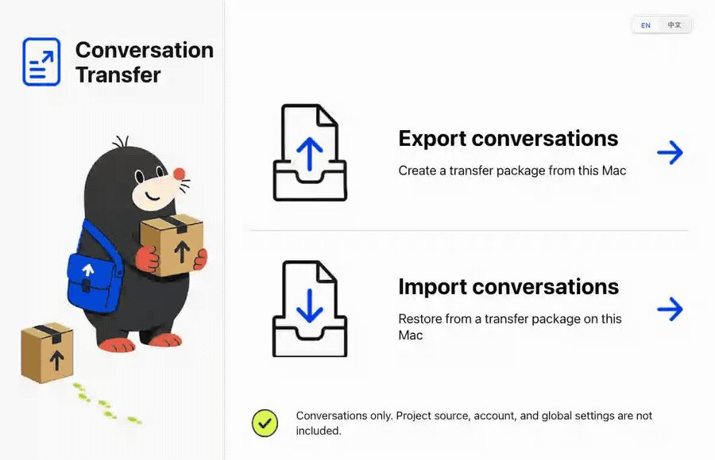
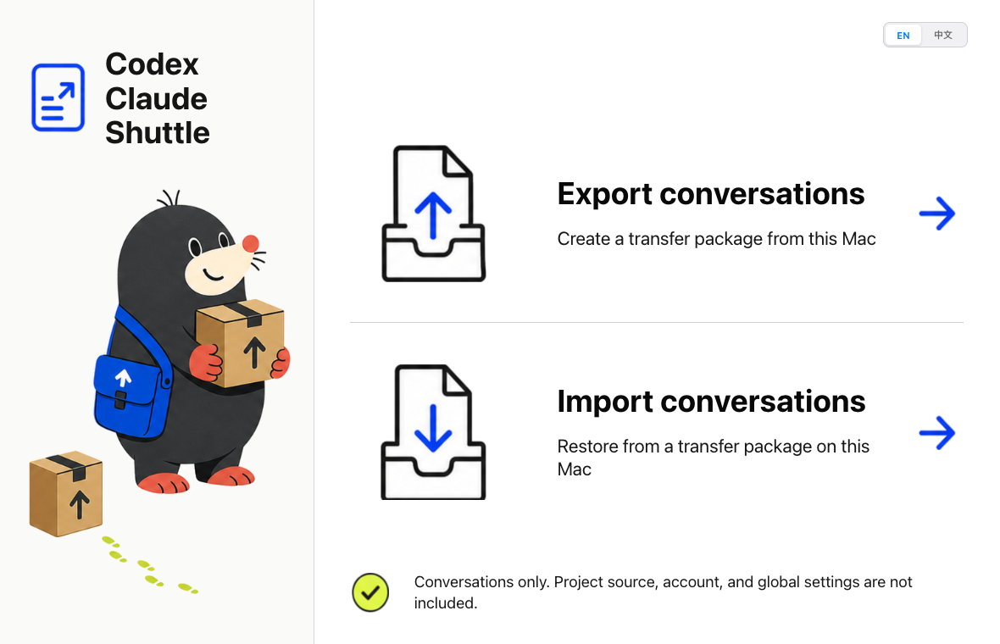
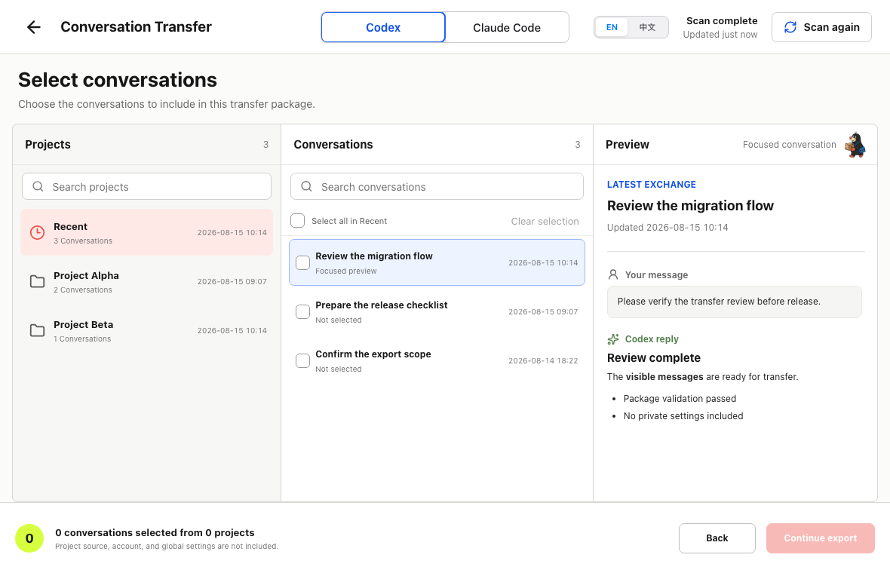
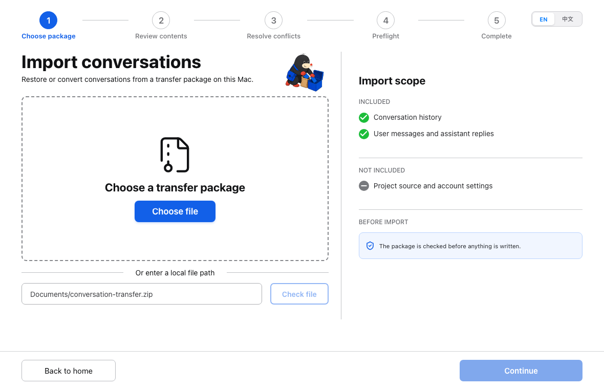

<div align="center">
  
  <h1>Codex Claude Shuttle</h1>
  <p><strong>在不同电脑之间，或在 OpenAI Codex 与 Anthropic Claude Code 之间迁移本地对话。</strong></p>
  <p>无需云服务 · 无需部署服务器 · 无需产品账号 · 日常使用无需命令行</p>
  <p>
    <a href="https://github.com/giraffegzy-bot/codex-claude-shuttle/actions/workflows/ci.yml"></a>
    <a href="LICENSE"></a>
  </p>
  <p><a href="README.md">English</a> · <strong>简体中文</strong></p>
</div>

> [!IMPORTANT]
> Codex Claude Shuttle 是非官方、独立的开源项目，与 OpenAI、Anthropic 没有隶属、赞助或官方认可关系。



## 下载

`v0.1.3` 是早期公开预览版。使用前请备份现有对话数据，并优先用非关键对话测试。

| 平台 | 预览版下载 | 当前状态 |
| --- | --- | --- |
| macOS Apple 芯片 | [应用 ZIP](https://github.com/giraffegzy-bot/codex-claude-shuttle/releases/download/v0.1.3/Codex-Claude-Shuttle-macOS-arm64.zip) | 本地自签名，尚未通过 Apple 公证 |
| Windows x64 | [安装程序 EXE](https://github.com/giraffegzy-bot/codex-claude-shuttle/releases/download/v0.1.3/Codex-Claude-Shuttle-Windows-x64-Setup.exe) | 未签名；CI 构建通过，实体机验收待完成 |

下载应用时请同时下载 [SHA256SUMS.txt](https://github.com/giraffegzy-bot/codex-claude-shuttle/releases/download/v0.1.3/SHA256SUMS.txt)，并在打开应用前核对文件。完整预览边界见 [v0.1.3 发布说明](https://github.com/giraffegzy-bot/codex-claude-shuttle/releases/tag/v0.1.3)。

暂不提供 Intel Mac 和 Linux 版本。预览包尚未使用商业代码签名，macOS 或 Windows 可能显示未知开发者警告。

## 这是做什么的

Codex Claude Shuttle 适合需要把选中的本地对话历史迁移到另一台电脑，或希望在另一个 AI 编程工具中继续可见对话内容的人。

- 按项目浏览、搜索和选择 Codex 或 Claude Code 的活动对话，导出前预览消息。
- 生成包含清单和 SHA-256 完整性校验的本地 ZIP 迁移包。
- 为来源项目映射现有目标文件夹后，恢复经过校验的原生对话。
- Codex 与 Claude Code 跨工具转换前展示转换边界，并在确认后迁移可见对话文本。
- 目标工具运行时禁止写入；导入前检查冲突和磁盘空间，替换时创建备份，提交后逐文件校验。
- 对话数据始终只在当前电脑本地处理。

## 支持的迁移方向

| 来源 | 目标 | 结果 |
| --- | --- | --- |
| Codex | Codex | 保留经过校验的原生对话，只更新目标项目路径字段 |
| Claude Code | Claude Code | 保留经过校验的原生对话，只更新目标项目路径字段 |
| Codex | Claude Code | 转换用户可见消息和助手最终可见回复 |
| Claude Code | Codex | 转换用户可见消息和助手最终可见回复 |

跨工具转换**不会**迁移内部推理、工具调用与结果、子代理、Memory、Skills、附件、认证信息、全局配置或原生运行状态。

## 产品截图



| 选择并预览对话 | 检查导入包 |
| --- | --- |
|  |  |

## 使用方法

1. 在来源电脑和目标电脑安装对应平台的预览版。
2. 在来源电脑打开“导出对话”，选择 Codex 或 Claude Code，勾选对话后把 ZIP 迁移包保存到本地。
3. 通过可信方式把 ZIP 迁移包移动到目标电脑。迁移包当前没有加密。
4. 在目标电脑打开“导入对话”，检查迁移包，并为每个来源项目选择已有的本地项目文件夹。
5. 完全退出目标工具，运行预检，核对写入计划后确认导入。

Codex Claude Shuttle 只移动对话，不复制项目源码，也不会自动创建缺失的项目目录。Shuttle 本身永远不要求注册账号；相关电脑上必须已有 Codex 或 Claude Code 的本地对话数据。

## 隐私与安全

Codex Claude Shuttle 不会上传对话数据，也不依赖托管后端。应用会把每个迁移包视为不可信输入，在提出任何写入计划前完成检查。

SHA-256 可以发现迁移包内容被改动，但不能证明迁移包由谁创建。当前版本的迁移包尚未加密，请按敏感文件存储和传输。

应用不会写入 Codex SQLite、Claude 全局配置、凭据或私有索引。详细安全边界与私密上报方式见 [SECURITY.md](SECURITY.md) 和[威胁模型](docs/threat-model.md)。

## 当前限制

- 尚未完成 Apple 公证和商业代码签名。
- Windows 实体机安装与迁移验收尚未完成。
- 自动化写入测试只使用临时目录和合成对话，尚未针对用户当前的 `~/.codex` 或 `~/.claude` 目录完成真实数据写入验收。
- Claude Code 跨设备导入后的继续对话，仍需针对支持的客户端版本完成真实设备验收。
- 暂不支持迁移包加密、自动创建项目目录、应用内更新和 Linux 构建。
- Codex 与 Claude Code 使用的本地私有格式可能变化，请保留备份并先用非关键对话测试。

## 从源码构建

环境要求：Go 1.25.12、Wails 2.14.0、Node.js 22.12 或更高版本、pnpm 10.33.0。

```bash
git clone https://github.com/giraffegzy-bot/codex-claude-shuttle.git
cd codex-claude-shuttle
go install github.com/wailsapp/wails/v2/cmd/wails@v2.14.0
pnpm --dir frontend install --frozen-lockfile
pnpm --dir frontend build
go test ./...
go vet ./...
pnpm --dir frontend check
pnpm --dir frontend test
wails build -clean
```

构建产物位于 `build/bin/`。开发规则见 [CONTRIBUTING.md](CONTRIBUTING.md)，架构说明见 [docs/architecture.md](docs/architecture.md)，桌面技术栈决策见 [docs/adr/0001-desktop-stack.md](docs/adr/0001-desktop-stack.md)。

## 参与贡献

欢迎提交 Issue 和范围明确的 Pull Request。复现问题时只能使用合成数据，不要上传真实迁移包、对话、完整本地路径、凭据、Token 或 Cookie。参与贡献前请阅读 [CONTRIBUTING.md](CONTRIBUTING.md)；安全漏洞请按照 [SECURITY.md](SECURITY.md) 私密上报。

## 许可证

Codex Claude Shuttle 使用 [MIT License](LICENSE) 开源。
